# Developer Guide

--------------------------------------------------------------------------------------------------------------------

## Table of Contents

- [Acknowledgements](#acknowledgements)
- [Design](#design)
  - [UI](#ui)
  - [ProcessCommand](#processcommand)
  - [Storage](#storage)
  - [Exceptions](#exceptions)
- [Implementation](#implementation)
  - [Expenditure Tracker](#expenditure-tracker)
  - [GPA Calculator](#gpa-calculator)
  - [Mathematical Graph Demo](#mathematical-graph-demo)
  - [Timetable Tracker](#timetable-tracker)
  - [Motivational Quotes](#motivational-quotes)
- [Appendix](#appendix)
  - [Product Scope](#product-scope)
  - [User Stories](#user-stories)
  - [Non-Functional Requirements](#non-functional-requirements)
  - [Glossary](#glossary)
  - [Instructions for Manual Testing](#instructions-for-manual-testing)
    - [Launch and Shutdown](#launch-and-shutdown)
    - [Help](#show-help)
    - [Expenditure Tracker](#expenditure-tracker-1)
    - [GPA Calculator](#gpa-calculator-1)
    - [Timetable Tracker](#timetable-tracker-1)

--------------------------------------------------------------------------------------------------------------------

## Acknowledgements

We referenced [AddressBook_Level3](https://github.com/se-edu/addressbook-level3) by using their 
[User Guide](https://github.com/AY2324S2-CS2113T-T09-4/tp/blob/master/docs/UserGuide.md) and
[Developer Guide](https://github.com/se-edu/addressbook-level3/blob/master/docs/DeveloperGuide.md) to help us structure our own documents.

We used [PlantUML integration](https://plantuml.com/starting) plugin to help us create our diagrams.

We used [PlantUML webpage](https://plantuml.com/) to understand PlantUML syntax

--------------------------------------------------------------------------------------------------------------------

## Design

The sequence diagrams for our main class, CantVasMain and its interactions with
other classes.

### UI

**API:** [`UI.java`](https://github.com/AY2324S2-CS2113-W13-3/tp/blob/master/src/main/java/cantvasui/UI.java)

How `UI` works:
1. Reads in user input and send the command to `CantVasMain` for parsing and execution. 
2. Prints an output based on user input. 
3. Reads in user input for steps in GPA calculator.

**Diagrams**

*Sequence Diagram*

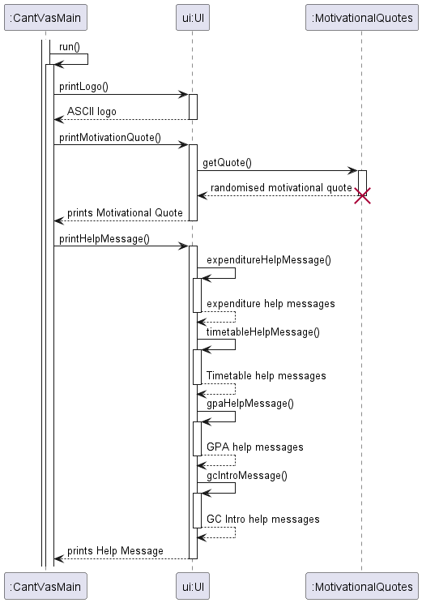

### ProcessCommand

**API:** [`ProcessCommand.java`](https://github.com/AY2324S2-CS2113-W13-3/tp/blob/master/src/main/java/processusercommands/ProcessCommand.java)

How `ProcessCommand` works:
1. `CantVasMain` receive the user input from `UI` and passes it to `ProcessCommand`.
2. Depending on the type of command, `ProcessCommand` passes the command to
   1. `processExpenditureUserCommand` or `TimetableParser` if the command is for expenditure 
   and timetable to further parse the command.
   2. `GPACommand` or `ProcessListCommand` for GPA calculator to receive more user inputs.
3. Returns true to `CantVAsMain` when the `exit` command is entered, ends CantVas.

**Diagrams**

*Class Diagram*

*Sequence Diagram*

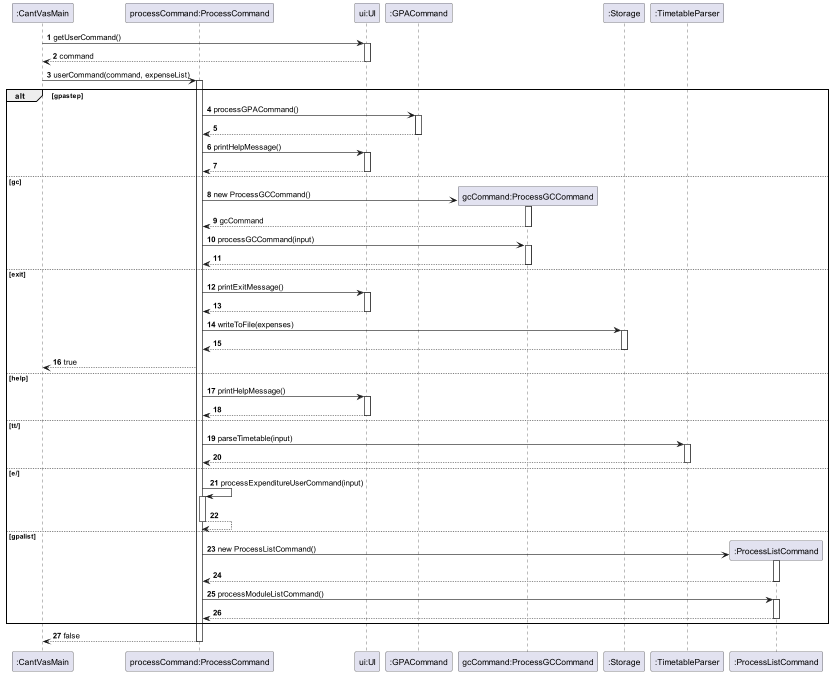

### Storage

**API:** [`Storage.java`](https://github.com/AY2324S2-CS2113-W13-3/tp/blob/master/src/main/java/storage/Storage.java)

How `Storage` works:
1. Saves expenditure list, timetable list and gpa list in its respective text file.
   All text will be in a folder called data for easy location.
2. When `ProcessCommand` receives the `exit` command, `Storage` writes expenditure and
   timetable lists to their respective text file for saving.
3. Reads in data from text file and process the data into strings to pass into
   `addExpenditure`, `addModule` and `addClass` methods. 
4. If a text file or the data directory is not found when trying to read,
   `Storage` will create a new file/ directory and return an empty list to the caller.
5. `PrintWriter` and `File` and `Scanner` classes are responsible 
   for the writing, opening and reading from files respectively.

**Diagrams**

*Class Diagram*

### Exceptions

**API:** [`InvalidInputFormatException.java`](https://github.com/AY2324S2-CS2113-W13-3/tp/blob/master/src/main/java/exceptions/InvalidInputFormatException.java)

How `Exceptions` work:
1. Throws an error message when the user enters an input that 
   has the wrong format and the user will be informed about their wrong format.
2. Takes in an error message when thrown that can be printed.

--------------------------------------------------------------------------------------------------------------------

## Implementation

### Expenditure Tracker

**API:**
[`Expenditure.java`](https://github.com/AY2324S2-CS2113-W13-3/tp/blob/master/src/main/java/expenditure/Expenditure.java)

The Expenditure Tracker simplifies expense tracking, allowing users
to log daily spending. With filters for month, year, and type, it 
aims to promote financial awareness, aiding informed decision-making
for better financial health.

The `ExpenditureList` class is responsible for managing a collection of
expenditures. It provides methods for adding, deleting and listing expenditures.

The `Expenditure` class represents individual expenditure instance within the system.
Each expenditure object contains key attributes such as description, type, amount and date.

*Class Diagram*

How `Expenditure` works:
1. When a new expenditure is added, ExpenditureList.java creates a new
   Expenditure object with the provided details and adds it to the expenditureList.
2. When an expenditure is deleted, ExpenditureList.java removes the Expenditure object
   at the specified index from the expenditureList.
3. When expenditures are listed, ExpenditureList.java iterates over the expenditureList
   and calls the toString() method of each Expenditure object to get a string representation
   of the expenditure.
4. When expenditures are listed by month, year, or type, ExpenditureList.java filters the
   expenditureList based on the specified criteria and returns a new list of Expenditure
   objects that match the criteria.
5. The isValidDate(), isValidMonth(), isValidAmount(), isValidType(), and isValidDescription()
   methods in ExpenditureList.java are used to validate the details of an expenditure before it
   is added to the expenditureList.

#### Add expenditure

How `add expenditure` behaves:
1. 

Adding an expenditure in numerical form.
Format: add n/DOLLARS_AND_CENTS d/DD.MM.YYYY
Example: add n/3.22 d/31.01.2024

**SequenceDiagram**

#### Viewing expenditures:
Viewing an expenditure in numerical form, in sequence of when they are added.
Format: list
Example: list

**SequenceDiagram**
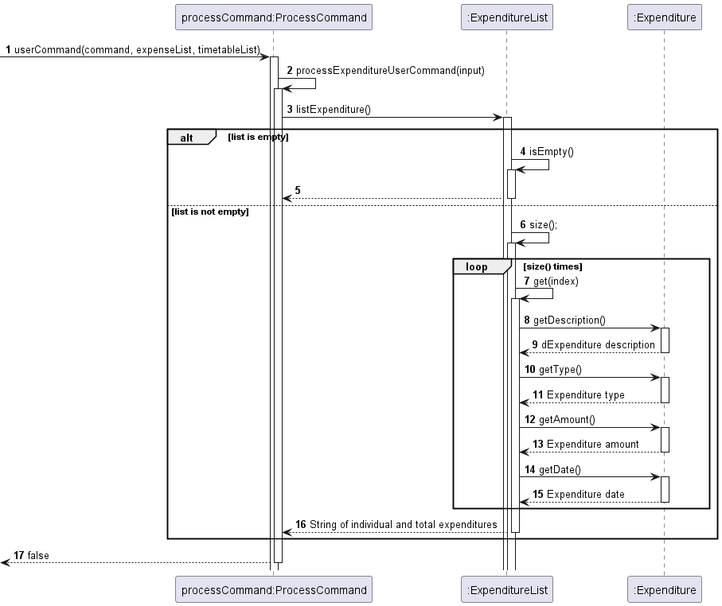

#### Viewing expenditures by month:
Viewing an expenditure in numerical form, filtered by month.
Format: e/ view/ m/ MM.YYYY
Example: e/ view/ m/ 01.2023

#### View expenditure by year:
Viewing an expenditure in numerical form, filtered by year.
Format: e/ view/ y/ YEAR
Example: e/ view/ y/ 2023

#### View expenditure by type:
Viewing an expenditure in numerical form, filtered by type.
Format: e/ view/ t/ TYPE
Example: e/ view/ t/ food

**SequenceDiagram**
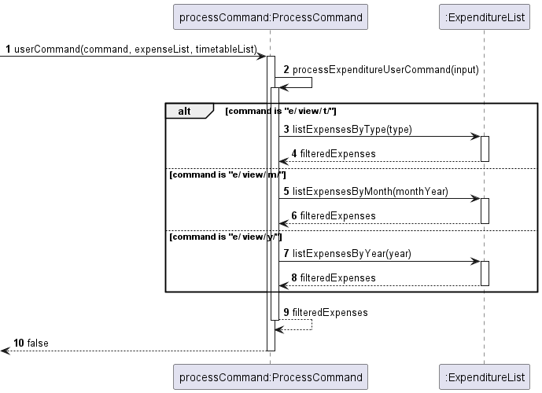

#### Delete expenditure:
Deleting an expenditure in numerical form, by referencing its index in the array.
Format: e/ del/ INDEX
Example: e/ del/ 3

**SequenceDiagram**
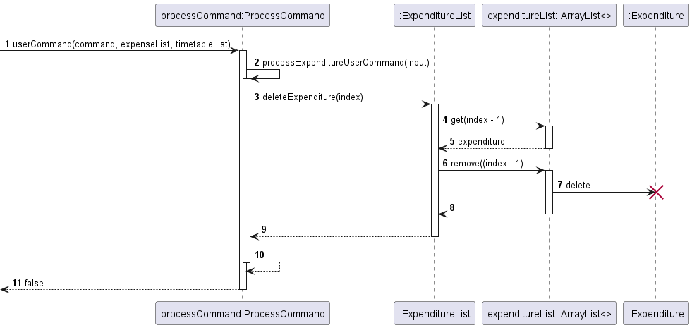

------------------------------------------------------------------------------------------

### GPA Calculator
The GPA Calculator Module is a comprehensive component designed to facilitate the calculation 
of a user's updated GPA based on their current academic standing and projected module grades.
This guide will walk developers through the architecture, functionality, and core components of the module.

#### Overview
The module is divided into 5 classes dealing with 2 different calculation methods.

#### Module
Handles user input of module information: module name, module weightage and module grade.

Here we demonstrate the Sequence Diagram with sample input CS1010 with 4 MC and A grade.

#### ModuleList
This extends Module class, which is used to execute actions like add/delete/view regarding the 
module list.

Here we demonstrate the Sequence Diagram with sample input CS1010 with 4 MC and A grade.
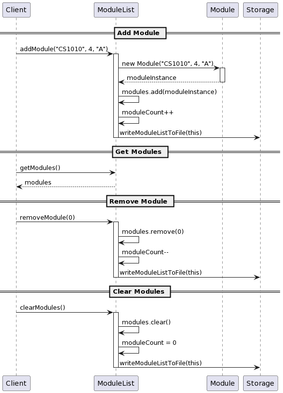

#### GPACommand
This class is responsible for interacting with the user, collecting inputs,
and managing the flow of the GPA calculation process. It operates within a loop,
allowing the user to perform multiple calculations or exit at any point.

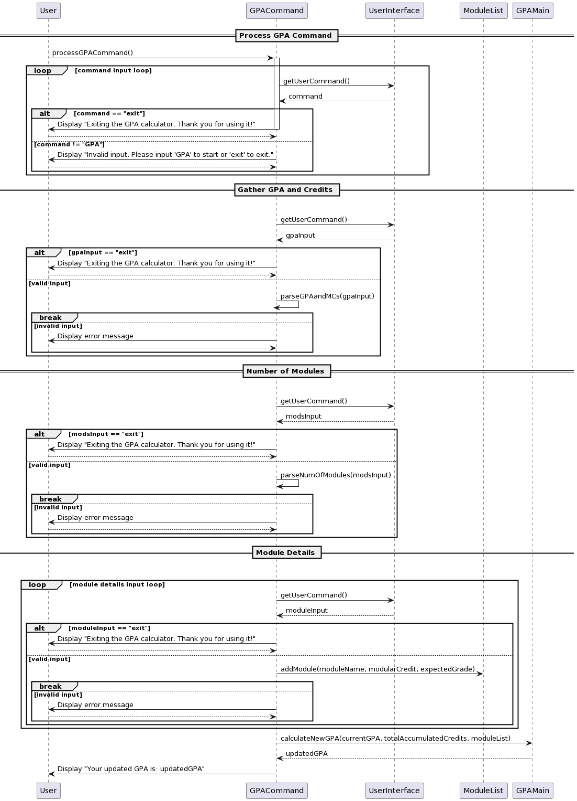

#### GPAMain: 
Contains the logic for calculating the GPA.

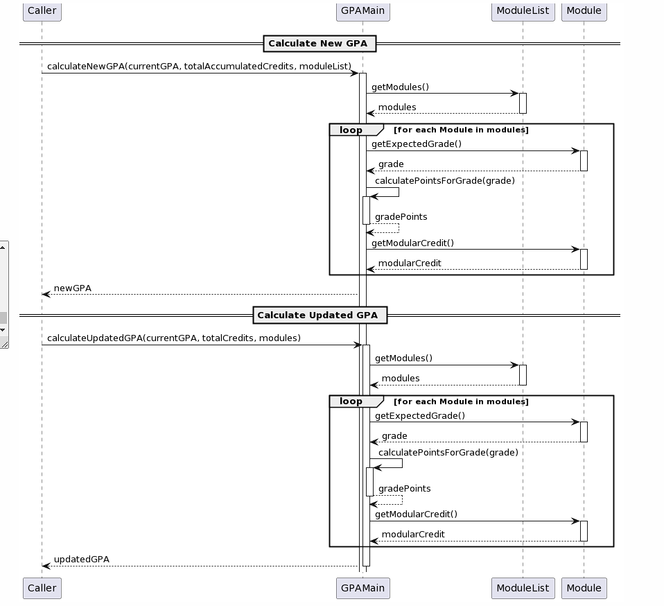

#### ProcessListCommand
This class is in charge of calculation of GPA by Module List method by identifying user's input.

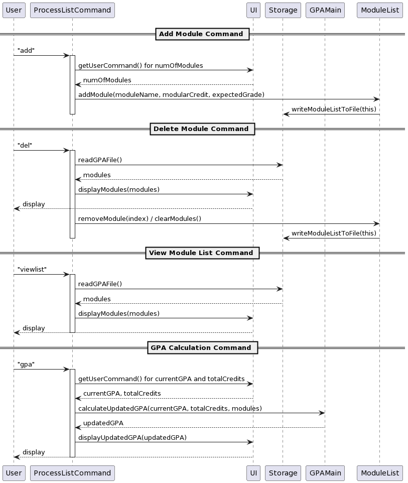

### Workflow for step-by-step GPA calculator
#### Start/Exit Prompt: 
Prompt the user to start the calculation or exit.
#### GPA and MCs Input: 
Collect the user's current GPA and the number of Modular Credits (MCs) taken.
#### Module Details Input: 
For each module the user wants to add, collect the module name ,modular credit and the expected grade.
#### GPA Calculation: 
Calls GPAMain.calculateNewGPA to compute the updated GPA based on inputs.
#### Display Updated GPA: 
Displays the calculated updated GPA to the user.

### Workflow for module list GPA calculator
#### Adding module 
User can access this via `add` command.
#### Store Module information into txt file
Modules information will be stored into the `gpa.txt` file in data folder.
#### Delete/Edit modules list
User can access this function via `del` command. User will be prompt to either delete specific module
information, or to clear the whole module list.
#### View Current Module List
Can be accessed via `viewlist` command. Current module list information will be printed out 1 by 1.
#### GPA calculation
Can be accessed via `gpa` command.
After prompted to input current GPA and numbers of MC taken.
The program will automatically output the GPA based on the information store in the Module List.
User is prompt to edit the module list first before proceed with calculation.

#### Key Methods
#### calculateNewGPA()
input: double currentGPA, int totalAccumulatedCredits, int numOfModules, int[] moduleCredits, String[] moduleGrades
Calculates and returns the updated GPA.

#### GPA Calculation Logic
#### Total Points Calculation: 
Calculates the total points achieved so far by multiplying the current GPA by the total accumulated credits.
#### Add Points for New Modules: 
For each new module, add to the total points based on the grade and credits.
#### Calculate Updated GPA: 
Divide the total points by the new total credits (accumulated + new modules) to get the updated GPA.

------------------------------------------------------------------------------------------

### Mathematical Graph Demo

#### Overview

The Graph Demo function uses JPanel , which is a simple GUI tool in javax.swing package.
With pre-written formula and defined size of parameters, therefore we can demonstrate the 
mathematical formula with illustration.

------------------------------------------------------------------------------------------

### Timetable Tracker

The timetable tracker facilitates the management of class schedules. It aims to provide users with a 
convenient way to organize and track their classes throughout the week. Users can add, delete, 
and view classes based on specific days, enabling efficient scheduling and time management 
enhancing the overall productivity and organization of users.

The `TimetableParser` class is responsible for parsing commands related
to timetable tracker and calling the respective methods in `timetableList`.

The `timetableList` class is responsible for managing a collection of classes.
It provides methods for adding, deleting and listing timetable.

The `class` class represents individual class instance within the system.
Each class object contains key attributes such as code, time, duration and location.

**Class Diagram**

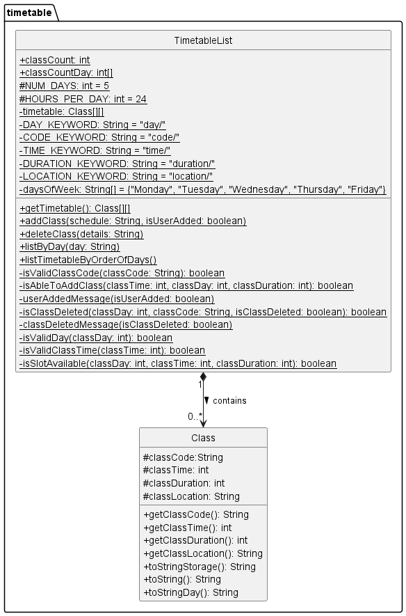

#### Add Class

**SequenceDiagram**

#### List Class

View classes in order of day and time.

**SequenceDiagram**

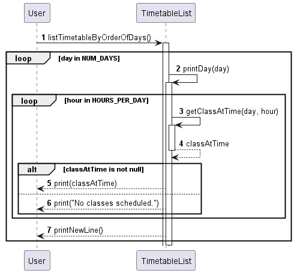

#### List Class by day

View classes for a specific day.

**SequenceDiagram**

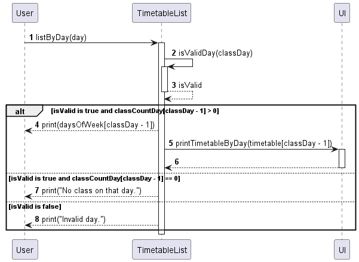

#### Delete Class

**SequenceDiagram**

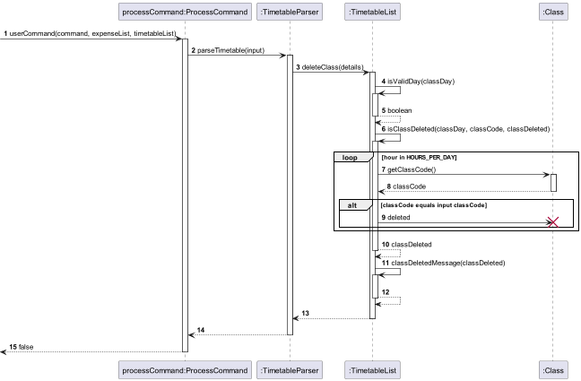

------------------------------------------------------------------------------------------

### Motivational Quotes
The Motivational module prints a randomly generated motivational quote for the user whenever the program starts

------------------------------------------------------------------------------------------

## Development Notes
Input Validation: Ensure that GPA scores and credit numbers are within valid ranges. This module expects a GPA between 0 and 5, and non-negative numbers for credits.

Error Handling: Properly handle invalid inputs, such as non-numeric values for credits or unsupported grade values.

Assertions: Use assertions to catch unexpected values during development. Ensure they are adequately handled or logged.

## Future Enhancements
GUI Integration: Consider developing a graphical user interface for easier input and interaction.

Persistent Data: Implement functionality to save and retrieve historical GPA calculations.

Expanded Grade Scale: Allow for customization of the grade to GPA points mapping to accommodate different institutions' grading scales.

--------------------------------------------------------------------------------------------------------------------

## Appendix

### Product scope

#### Target user profile

- NUS Students
- Prefers typing

#### Value proposition

CantVas offers users the ability to efficiently monitor their expenses, enabling them to enhance 
their financial management skills. Additionally, students can utilize CantVas to calculate their GPA grades, 
facilitating academic success. With its versatile functionality, CantVas serves as a comprehensive 3-in-1 
solution for users to manage expenditure, timetable, and GPA, thereby enhancing their overall organizational 
capabilities and productivity.

### User Stories

| Version | As a ...                                | I want to ...                                                        | So that I can ...                                                                 |
|---------|-----------------------------------------|----------------------------------------------------------------------|-----------------------------------------------------------------------------------|
| v1.0    | international student on a budget       | use CantVas to add my purchases                                      | meticulously record my expenses                                                   |
| v1.0    | analytical student                      | view a breakdown of his expenditures                                 | focus on financial responsibility                                                 |
| v1.0    | budget-conscious student                | view my expenses filtered by specific months and years               | track my progress towards financial goals and identify any trends over time       |
| v1.0    | long-term planner                       | see an overview of my expenditures grouped by year                   | evaluate my financial health and plan for future expenses accordingly             |
| v1.0    | student who wants to start fresh        | ability to delete all of my recorded expenditures                    | reset my financial tracking system and begin anew                                 |
| v1.0    | careless user                           | delete wrong items in the expenditure tracker                        | add back the correct item in the expenditure tracker                              |
| v1.0    | user who needs assistance               | be able to access help information within the application            | understand how to use its features effectively                                    |
| v1.0    | user finished with my tasks             | be able to exit the application easily                               | close it and move on to other activities                                          |
| v1.0    | Proactive business major                | calculate my course grades on CantVas step by step                   | see which mod I have to SU                                                        |
| v1.0    | user who values user assistance         | access help information and exit the GPA calculator easily           | get assistance if needed and navigate the application seamlessly                  |
| v2.0    | organized student                       | add my expenses by type                                              | understand where my money is going and make informed financial decisions          |
| v2.0    | strategic spender                       | categorize and view my expenditures by type                          | identify areas where I can potentially cut costs or adjust my budget.             |
| v2.0    | user seeking daily inspiration          | see motivational quotes and tips CantVas provides at startup         | stay motivated throughout her academic journey                                    |
| v2.0    | student trying to organize my schedule  | input my classes into the timetable tracker                          | keep track of the classes I have                                                  |
| v2.0    | student who needs to adjust my schedule | remove specific classes from my timetable                            | ensure the timetable accurately reflects my current commitments                   |
| v2.0    | student planning for the upcoming week  | see all my classes scheduled for the week in one place               | plan my study and extracurricular activities efficiently                          |
| v2.0    | student organizing my daily tasks       | check my classes for a specific day                                  | focus on the tasks and commitments for that day without feeling overwhelmed       |
| v2.0    | meticulous user                         | add modules to the list by inputting their details                   | maintain a comprehensive record of all the modules I've taken for GPA calculation |
| v2.0    | detail-oriented student                 | edit the module list, including adding, deleting, or viewing modules | ensure the accuracy of my GPA calculation                                         |

### Non-Functional Requirements

1. Should be portable and working on any mainstream OS as long as it has Java 11 or above installed.
2. Should be able to hold up to 1000 or more expenditure without any change in performance of CantVas.
3. Should be able to handle exceptions and edge cases for smooth operation.
4. A user with an average typing speed in regular English text (not code or system admin commands) should find that
   they can complete most tasks more quickly using text commands rather than relying on the mouse.
5. Comprehensive unit tests should be implemented within the application to guarantee accurate functionality,
   streamline maintenance, and facilitate future enhancements.

## Glossary

* *glossary item* - Definition
* *Mainstream OS*: Windows, Linux, Unix, macOS

## Instructions for manual testing

Given below are instructions on how to test the app manually.

### Launch and Shutdown

1. Initial launch
   1. Download the jar file and copy into an empty folder
   2. Open a terminal and change directory to the folder created with the jar file inside and 
   type java -jar CantVas.jar into the terminal.

2. Shutdown
   1. When CantVas is running, type `exit` to close CantVas.

### Show help

1. Prerequisites: NIL
2. Test case 1: `help`

   Expected: All commands and their format will be shown.

### Expenditure Tracker

#### Adding expenditure

1. Prerequisites: NIL
2. Test Case 1: `e/ add/ d/ shopping amt/ 128.00 date/ 31.03.2024`

   Expected: A new expenditure with type NA is added successfully.

3. Test case 2: `e/ add/ d/ spider-man tickets t/ movie amt/ 13.50 date/ 12.02.2024`

   Expected: A new expenditure with type MOVIE is added successfully.

#### View Expenditure

1. Prerequisites: Added the 2 expenditure in [Adding Expenditure](#adding-expenditure)
2. Test case 1: `e/ list/`
   
   Expected: The current expenditure list will be shown along with the total expenses.

3. Test case 2: `e/ view/ m/ 03.2024`

   Expected: The expenditure list for 03.2024 will be shown, 
   at least 1 should be the shopping expenditure previously added.

4. Test case 3: `e/ view/ y/ 2024`

   Expected: The expenditure list for 2024 will be shown,
   the 2 previously add expenditure should be shown.

5. Test case 4: `e/ view/ t/ movie`

   Expected: The expenditure list for type movie will be shown,
   at least 1 should be the spider-man tickets previously added.

#### Deleting expenditure

1. Prerequisites: List all expenditure using `e/ list/`
2. Test case 1: `e/ del/ 1`

   Expected: The first expenditure in the list will be deleted and the details will be shown.

3. Test case 2: `e/ clearlist/`
    
   Expected: The whole expenditure list should be cleared.
   No expenditure should be shown when `e/ list/` is entered.

### GPA Calculator

### Mathematical Graph Demo

### Timetable Tracker

#### Adding class

1. Prerequisites: NIL
2. Test case 1: `tt/ add/ day/ 5 code/ cs2113 time/ 16 duration/ 2 location/ LT16`

   Expected: Class is added successfully with the correct day, code, time, duration and location.

3. Test case 2: `tt/ add/ day/ 2 code/ cs2113 time/ 10 duration/ 1 location/ COM1-0210`

   Expected: Class is added successfully with the correct day, code, time, duration and location.

#### Viewing classes

1. Prerequisites: Added the 2 classes in [Adding class](#adding-class)
2. Test case 1: `tt/ list/`
    
   Expected: 1 class is shown on tuesday for cs2113 for a duration of 1 at 10,
   2 class for cs2113 will be shown with decreasing duration to represent
   the time left before the class ends.

3. Test case 2: `tt/ list -d/ 5`

    Expected: Friday timetable should be shown with the cs2113 class shown for 16:00 and 17:00.

#### Deleting class

1. Prerequisites: List add classes using `tt/ list/`, there should be cs2113 class on friday.
2. Test case 1: `tt/ del/ day/ 5 code/ cs2113`

   Expected: The cs2113 class on friday should be deleted. 
   No cs2113 class should be shown when `tt/ list -d/ 5` is entered.

